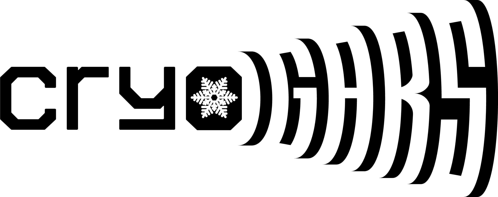
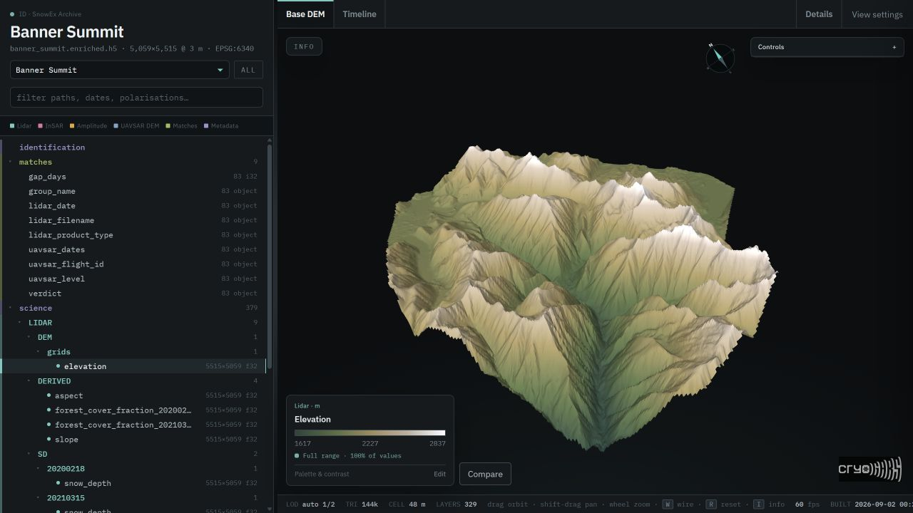
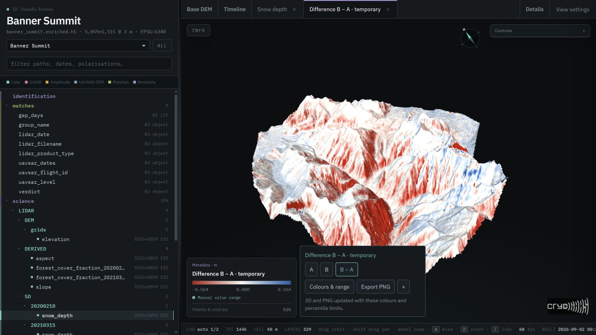

<p align="center">
  
</p>

# SnowEx Field Atlas

**Explore aligned LiDAR and UAVSAR observations, compare snow products, and
inspect the data behind them.**

Built by **Anant Gahlaut** at [CryoGARS](https://github.com/cryogars),
Cryosphere, Geophysics and Remote Sensing research lab, Boise State University.

**Research preview · 8 field sites · 1,664 display layers**

Release target: **v1.0.05** · fifth enrichment cycle.

[Viewer](#viewer) · [Download the archive](#download-the-archive) ·
[Work in progress](#work-in-progress)

## Viewer

### [Open the 3D Atlas →](https://anantgahlaut.github.io/cryogars-atlas-viewer/)

Choose a site and open its explorer. No sign-in, Python installation, or HDF5
download is required. Use a modern WebGL-capable browser; desktop viewing is
recommended.



*Banner Summit elevation, displayed on the existing 3D terrain mesh. The data
tree, colour legend, and comparison controls remain available beside the map.*

### What it does

- **Explore the observations in 3D.** View terrain, LiDAR snow depth and vegetation
  height, UAVSAR amplitude, coherence, phase, and available derived products.
- **Find the right layer.** Search the archive hierarchy, switch sites, and use
  the acquisition timeline to inspect survey dates and radar pairs.
- **Inspect context and methods.** Open product information and notes for units,
  grid spacing, data availability, source information, equations, and limitations.
- **Control the display.** Blend overlays, adjust terrain detail and lighting,
  choose palettes and colour stretches, and save custom palette presets by
  product type.
- **Compare two products.** Select another same-product layer or temporarily
  import a numeric GeoTIFF. Switch between reference **A**, comparison **B**,
  and **B − A** on the existing 3D terrain.
- **Export a 2D figure.** Choose comparison colours and percentile limits, then
  export a north-up PNG with its legend, source labels, comparison direction,
  coordinate system, and analysis-grid resolution.

Imported GeoTIFFs and comparison results stay in the visitor's browser. They
are not uploaded or added to the permanent archive.



*An actual browser comparison at Banner Summit: B = 2021-03-15 snow depth,
A = 2020-02-18 snow depth. The screenshot uses a robust 2nd–98th percentile
colour stretch with symmetric difference limits. This illustrates differences
between two surveys, not model accuracy.*

### How it works

1. **Prepare a common reference grid.** The pipeline reprojects and resamples
   accepted rasters onto each site's 3 m DEM reference grid and stores the
   aligned layers, coordinates, dates, and metadata in HDF5. The same row and
   column represent the same mapped location across aligned raster layers.
2. **Create a browser-sized export.** The exporter samples and quantizes display
   arrays, then embeds them with the application in a self-contained HTML page.
   The browser does not read or download the full HDF5 archive.
3. **Render and compare locally.** WebGL draws a DEM-based terrain mesh and
   colours it with the selected product. Automatic terrain detail adapts the
   mesh to the view; it does not increase the underlying data resolution.
   Comparisons align B to A's exported grid and use their shared valid cells.

The **archive grid, exported colour grid, and displayed terrain mesh are
different resolutions**. A 3 m common grid does not create native 3 m radar
information or guarantee common dates, vertical datums, or measurement accuracy.
Current website colour values are 8-bit quantized, and some products have clipped
tails. Comparison PNGs use the exported analysis grid, not the original 3 m
archive or a perspective screenshot. Colour stretches change appearance, not
the comparison's underlying samples or statistics.

Use the full archive for quantitative modeling. Read the
[comparison guide and limitations](docs/BROWSER_COMPARISON.md) and
[scientific notes](docs/scientific-notes.md) before interpreting differences.

The eight explorer pages total approximately **105 MiB**; larger sites can take
longer to load. Application code and display data are embedded. Optional Google
Fonts have local fallbacks.

<details>
<summary>Field sites and current viewer coverage</summary>

| Site | State | Snow-depth dates | Vegetation-height dates | Radar groups | Display layers |
| --- | --- | ---: | ---: | ---: | ---: |
| Grand Mesa | Colorado | 6 | 2 | 27 | 446 |
| Banner Summit | Idaho | 2 | 2 | 11 | 329 |
| Mores Creek | Idaho | 2 | 2 | 10 | 305 |
| Little Cottonwood Canyon | Utah | 1 | 1 | 6 | 177 |
| Fraser | Colorado | 2 | 2 | 5 | 159 |
| Cameron Pass | Colorado | 1 | 1 | 5 | 149 |
| Dry Creek | Idaho | 1 | 1 | 2 | 64 |
| Reynolds Creek | Idaho | 0 | 1 | 1 | 35 |
| **Total** | **3 states** | **15** | **12** | **67** | **1,664** |

These counts describe the published viewer snapshot, not incoming data awaiting
integration. Dates are counted within each site. Radar groups are
site/date-pair/flight-line combinations; shared flights can appear at multiple
sites. Display layers include radar channels and derived products, not just
independent observations. Reynolds Creek currently supplies terrain,
vegetation, and radar context, but no LiDAR snow-depth labels in this snapshot.

</details>

## Download the archive

The full-resolution analysis archive is separate from the browser viewer and
this source repository. It contains per-site HDF5 files with aligned LiDAR and
UAVSAR products, a common 3 m grid, temporal match tables, and processing metadata.

**The archive download link has not been published yet.** It will be added here
with the selected release version, file inventory, sizes, and verified SHA-256
checksums. The viewer link above is available now; it is not a download of the
full archive.

### What is inside

- **LiDAR:** terrain elevation, dated snow-depth and vegetation-height layers.
- **UAVSAR:** available polarizations, amplitudes, coherence, interferograms,
  unwrapped phase, and approximate geometry.
- **Derived layers:** slope, aspect, vegetation-height-based canopy fractions,
  and coherence masks, with product-specific qualifications.
- **Context:** CRS and affine transforms, source identifiers, survey/date-pair
  information, radar–LiDAR matches, and processing metadata.

Product availability varies by site. Base `<site>.h5` files are already aligned
and processed; `<site>.enriched.h5` files contain the enrichment stage. Neither
should be described as untouched sensor data.

<details>
<summary>HDF5 layout and a small Python example</summary>

```text
identification/                       site, grid, and processing metadata
matches/                              LiDAR–radar matching records
science/
  LIDAR/
    DEM/grids/elevation
    SD/<survey_date>/snow_depth
    VH/<survey_date>/veg_height
    DERIVED/
  UAVSAR/
    <date1>_<date2>/<flight_line>/
      <polarization>/
      GEOMETRY/
```

Read a small window without loading an entire site:

```python
import h5py

with h5py.File("path/to/archive/banner_summit.enriched.h5", "r") as archive:
    info = archive["identification"].attrs
    print("CRS:", info["common_crs_epsg"])
    print("Grid:", info["common_grid_shape"])

    surveys = archive["science/LIDAR/SD"]
    survey_date = sorted(surveys.keys())[0]
    depth = surveys[survey_date]["snow_depth"]
    window = depth[:256, :256]
    print(survey_date, window.shape, dict(depth.attrs))
```

Use the recorded transform and CRS to locate pixels. Preserve missing-value
masks, and keep readers closed while an archive writer is active. See the
[workflow guide](docs/workflows.md) for acquisition, generation, verification,
and building a viewer from an existing archive.

</details>

## Work in progress

**Status reviewed: 2026-09-13.** The public viewer is a working research
snapshot, not yet the final corrected scientific release. Approved corrections
have been implemented and tested in the working source, but that is distinct
from verifying regenerated HDF5 files and browser exports.

### Before the next scientific release

| Area | Current status and remaining work |
| --- | --- |
| Corrected archive and viewer | Aspect direction and circular display handling, cleaned-input derivatives, metadata, and label corrections are prepared in working source. Regenerate the affected products, validate all eight sites, and publish one matching viewer snapshot. The coordinated rebuild remains on hold pending final review. |
| Radar geometry | Look-side, projected-heading, and summary corrections are implemented. Actual aircraft-height compatibility, some vertical-reference information, and navigation accuracy still need supporting evidence. Incidence remains approximate; full terrain occlusion is not implemented. |
| Archive download and integrity | Finalize verified backup storage and the distribution files, generate and verify final release manifests, then publish the archive download. Validator and forward-provenance fixes are prepared; historical missing lineage remains explicitly unknown. |
| Reproducibility and usability | Test installation from a fresh environment, establish portable automated checks, and complete cross-browser, keyboard, palette, comparison/PNG, and memory-limit acceptance. Keep documentation, legend labels, and published versions synchronized. |
| New ASO observations | Reconcile missing/conflicting georeferencing, survey dates, duplicate products, masks, and modeled-density/SWE lineage before ingestion. These incoming packages are deferred and are not included in the viewer counts above. |
| Release metadata | Select the code license, finalize citation/contributor metadata, and review dataset attribution and distribution requirements. A later transfer to the CryoGARS organization remains separate. |

The immediate milestone is a **verified, versioned SnowEx archive with a
matching public viewer and reproducible download**, retaining the established
interface.

### Longer-term research

- Snow-depth modeling evaluated across held-out sites and later years.
- Density estimation and an eventual SWE product, with independent evaluation
  and explicit uncertainty and provenance.
- NISAR ingestion and visualization at substantially larger scales.

These are future research directions, not capabilities claimed by this release.
Browser comparison of a user-supplied prediction is already supported; a
validated retrieval model is not included.

### Documentation and attribution

[Comparison guide](docs/BROWSER_COMPARISON.md) ·
[Scientific notes](docs/scientific-notes.md) ·
[Data sources](docs/data-sources.md) ·
[Workflow guide](docs/workflows.md) ·
[Release notes](CHANGELOG.md) ·
[Release checklist](docs/release-checklist.md)

Observations are provided by the NASA SnowEx community, NASA/JPL UAVSAR, and
the NSIDC, ASF, and ORNL archives. Cite the original datasets and identify the
site, dates, subset, and processing version used in your analysis.

**Code license: not yet selected.** Source datasets retain their own attribution
and use requirements. The development repository remains private; the prepared
[viewer distribution](https://github.com/AnantGahlaut/cryogars-atlas-viewer) and
[hosted Atlas](https://anantgahlaut.github.io/cryogars-atlas-viewer/) are public.
